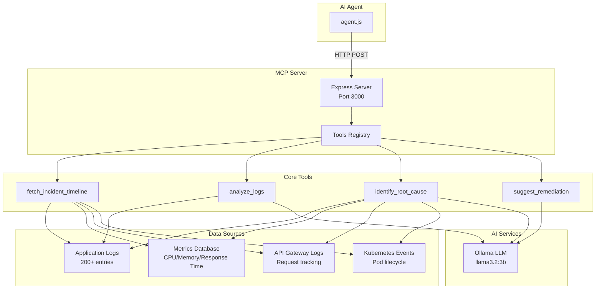
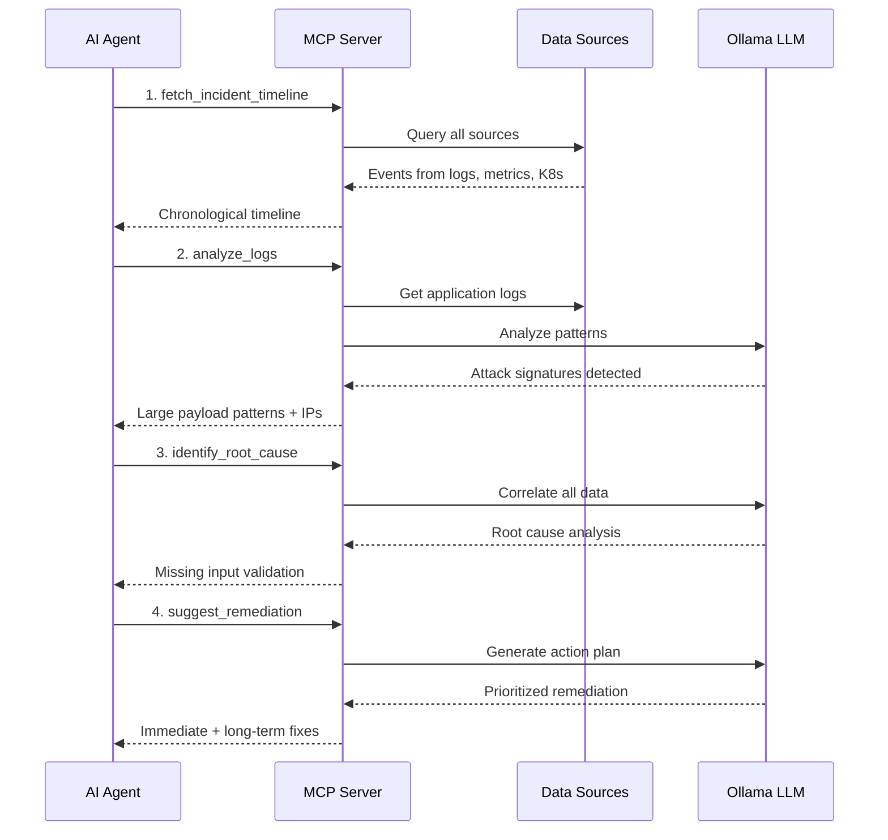

# DeepTrace 🔍

**AI-Powered Security Incident Investigation MCP Server**

DeepTrace is a Model Context Protocol (MCP) server that enables AI agents to investigate production security incidents, correlate data from multiple observability sources, perform intelligent root cause analysis, and generate actionable remediation plans.

## 🎯 Overview

This project simulates a real-world security incident where an attacker exploited a missing input validation vulnerability to launch a JSON payload bomb attack against a production search API. DeepTrace provides AI-powered tools to investigate, analyze, and respond to such incidents.

### The Incident Scenario

**Attack Type:** JSON Payload Bomb  
**Target:** `/api/search` endpoint  
**Vulnerability:** Missing input validation and rate limiting  
**Attack Timeline:** 14:15 - 14:30 UTC (15 minutes)

**Attack Progression:**
- 14:15 UTC: Attacker begins sending large payloads (5-10 MB)
- 14:17 UTC: Response time degrades from 200ms to 8+ seconds
- 14:20 UTC: CPU usage spikes to 95%
- 14:22 UTC: Memory reaches 90%, OOM kills begin
- 14:25 UTC: Kubernetes starts automatic pod restarts
- 14:28 UTC: Monitoring alerts trigger
- 14:30 UTC: Error rate reaches 45%

**Impact:**
- 40x response time increase (200ms → 8-12 seconds)
- CPU: 25% → 95%
- Memory: 40% → 90%
- Error rate: 0.2% → 45% (225x increase)
- 15 pod restarts in 10 minutes
- ~2,000 affected customers
- ~$8,000 in lost sales

## 🏗️ Architecture



## 🚀 Quick Start

### Prerequisites

1. **Node.js** (v18 or higher)
2. **Ollama** with llama3.2:3b model

### Installation

```bash
# Clone the repository
git clone <repository-url>
cd DeepTrace

# Install dependencies
npm install

# Generate attack simulation data
node data/generate_attack_data.js

# Install and start Ollama (if not already installed)
# macOS/Linux:
curl -fsSL https://ollama.com/install.sh | sh
ollama pull llama3.2:3b

# Start Ollama server (in a separate terminal)
ollama serve
```

### Running the Demo

```bash
# Terminal 1: Start the MCP server
node mcp_server.js

# Terminal 2: Run the investigation agent
node agent.js
```

## 🛠️ MCP Tools

### 1. fetch_incident_timeline

Build a chronological timeline of events from all observability sources.

**Endpoint:** `POST /tools/fetch_incident_timeline`

**Input:**
```json
{
  "start_time": "2026-01-29T14:00:00Z",
  "end_time": "2026-01-29T14:35:00Z",
  "sources": ["all"]
}
```

**Output:**
```json
{
  "timeline": [
    {
      "timestamp": "2026-01-29T14:15:00Z",
      "source": "api_gateway",
      "event_type": "large_request_detected",
      "severity": "warning",
      "details": {
        "request_size": "8.5MB",
        "endpoint": "/api/search",
        "source_ip": "203.0.113.45"
      }
    }
  ],
  "summary": {
    "total_events": 247,
    "by_severity": {
      "critical": 45,
      "high": 89,
      "warning": 67,
      "info": 46
    }
  },
  "attack_patterns": [
    {
      "pattern_type": "large_payload_burst",
      "description": "Multiple large requests from single source",
      "severity": "critical"
    }
  ]
}
```

### 2. analyze_logs

AI-powered log analysis to identify attack patterns and anomalies.

**Endpoint:** `POST /tools/analyze_logs`

**Input:**
```json
{
  "time_range": {
    "start": "2026-01-29T14:00:00Z",
    "end": "2026-01-29T14:35:00Z"
  },
  "log_level": "all",
  "limit": 500
}
```

**Output:**
```json
{
  "patterns": [
    {
      "pattern": "Request timeout - payload processing exceeded limit",
      "frequency": 47,
      "severity": "critical",
      "sample_ips": ["203.0.113.45"]
    }
  ],
  "anomalies": [
    {
      "timestamp": "2026-01-29T14:17:45Z",
      "source_ip": "203.0.113.45",
      "request_size": 8388608,
      "anomaly_type": "large_payload"
    }
  ],
  "ai_analysis": {
    "attack_type": "JSON Payload Bomb",
    "characteristics": "Single IP sending 5-10MB payloads with deeply nested objects",
    "impact": "CPU/memory exhaustion causing cascading failures",
    "confidence": 0.95
  }
}
```

### 3. identify_root_cause

Comprehensive root cause analysis using correlated data from all sources.

**Endpoint:** `POST /tools/identify_root_cause`

**Input:**
```json
{
  "incident_id": "INC-20260129-001",
  "include_metrics": true,
  "include_logs": true
}
```

**Output:**
```json
{
  "incident_id": "INC-20260129-001",
  "root_cause": "Missing input validation on /api/search endpoint",
  "contributing_factors": [
    "No rate limiting",
    "Insufficient resource limits",
    "Lack of payload size validation"
  ],
  "confidence_score": 0.92,
  "attack_type": "JSON Payload Bomb",
  "evidence": [
    {
      "type": "log_analysis",
      "description": "47 large payload requests detected (>5MB)",
      "severity": "critical"
    }
  ],
  "impact_assessment": {
    "pod_restarts": 15,
    "oom_kills": 15,
    "error_rate_increase": "225x",
    "response_time_increase": "40x"
  }
}
```

### 4. suggest_remediation

Generate prioritized, actionable remediation plan.

**Endpoint:** `POST /tools/suggest_remediation`

**Input:**
```json
{
  "root_cause": "Missing input validation on /api/search endpoint",
  "attack_type": "JSON Payload Bomb",
  "severity": "critical",
  "include_commands": true
}
```

**Output:**
```json
{
  "summary": "A JSON payload bomb attack exploited missing input validation...",
  "immediate_actions": [
    {
      "priority": 1,
      "action": "Block attacker IP address",
      "implementation": "Add firewall rule or update WAF",
      "estimated_time": "2 minutes",
      "commands": [
        "sudo iptables -A INPUT -s 203.0.113.45 -j DROP",
        "sudo nginx -s reload"
      ]
    }
  ],
  "short_term_fixes": [
    {
      "priority": 2,
      "action": "Implement request size validation",
      "implementation": "Add middleware to limit payload size to 1MB",
      "estimated_time": "2 hours",
      "implementation_code": "app.use(express.json({ limit: '1mb' }));"
    }
  ],
  "long_term_improvements": [
    {
      "priority": 3,
      "action": "Deploy Web Application Firewall",
      "implementation": "Implement ModSecurity with OWASP rules",
      "estimated_time": "1 week"
    }
  ]
}
```

## 📊 Data Sources

### Application Logs
- **Location:** `data/application_logs.json`
- **Entries:** 200 (153 normal + 47 attack)
- **Format:** JSON with timestamp, level, endpoint, request_size, response_time, source_ip

### Metrics Database
- **Location:** `data/metrics.json`
- **Data Points:** 35 (1-minute intervals)
- **Metrics:** CPU %, Memory %, Request Rate, Response Time (p50/p95/p99), Error Rate

### API Gateway Logs
- **Location:** `data/api_gateway_logs.json`
- **Entries:** 127
- **Fields:** request_id, timestamp, method, endpoint, request_size, response_code, source_ip

### Kubernetes Events
- **Location:** `data/kubernetes_events.json`
- **Events:** 25
- **Types:** pod_restart, health_check_failed, horizontal_scaling, deployment_update

## 🔬 Investigation Workflow

The AI agent follows this workflow to investigate the incident:



## 📝 Example Usage

### Using curl

```bash
# 1. Fetch incident timeline
curl -X POST http://localhost:3000/tools/fetch_incident_timeline \
  -H "Content-Type: application/json" \
  -d '{
    "start_time": "2026-01-29T14:00:00Z",
    "end_time": "2026-01-29T14:35:00Z",
    "sources": ["all"]
  }'

# 2. Analyze logs
curl -X POST http://localhost:3000/tools/analyze_logs \
  -H "Content-Type: application/json" \
  -d '{
    "time_range": {
      "start": "2026-01-29T14:00:00Z",
      "end": "2026-01-29T14:35:00Z"
    },
    "log_level": "all"
  }'

# 3. Identify root cause
curl -X POST http://localhost:3000/tools/identify_root_cause \
  -H "Content-Type: application/json" \
  -d '{
    "incident_id": "INC-20260129-001",
    "include_metrics": true,
    "include_logs": true
  }'

# 4. Suggest remediation
curl -X POST http://localhost:3000/tools/suggest_remediation \
  -H "Content-Type: application/json" \
  -d '{
    "root_cause": "Missing input validation",
    "attack_type": "JSON Payload Bomb",
    "severity": "critical"
  }'
```

### Using the AI Agent

```bash
# Run the automated investigation
node agent.js
```

The agent will:
1. Detect the incident alert
2. Fetch the timeline
3. Analyze logs for patterns
4. Identify the root cause
5. Generate a remediation plan
6. Display a comprehensive incident report

## 🧪 Testing

### Test Individual Tools

```bash
# Start the MCP server
node mcp_server.js

# In another terminal, test tools
curl http://localhost:3000/tools  # List all tools

# Test timeline tool
curl -X POST http://localhost:3000/tools/fetch_incident_timeline \
  -H "Content-Type: application/json" \
  -d '{"start_time":"2026-01-29T14:00:00Z","end_time":"2026-01-29T14:35:00Z"}'
```

### Verify Data Generation

```bash
# Check generated data files
ls -lh data/*.json

# View sample logs
head -n 20 data/application_logs.json | jq .

# Check metrics
jq '.[] | select(.timestamp | contains("14:20"))' data/metrics.json
```

## 📦 Project Structure

```
DeepTrace/
├── mcp_server.js              # Express MCP server
├── tools.js                   # MCP tool definitions
├── agent.js                   # AI investigation agent
├── package.json               # Dependencies
├── README.md                  # This file
├── data/
│   ├── generate_attack_data.js    # Data generation script
│   ├── application_logs.json      # 200+ log entries
│   ├── metrics.json               # Time-series metrics
│   ├── api_gateway_logs.json      # Request tracking
│   └── kubernetes_events.json     # Pod lifecycle events
├── services/
│   ├── ai_service.js              # Ollama integration
│   └── data_sources.js            # Data source connectors
└── utils/
    └── timeline_builder.js        # Event correlation utilities
```

## 🎓 Key Features

✅ **MCP Protocol Compliance:** Fully implements MCP specification  
✅ **Multi-Source Data Correlation:** Aggregates logs, metrics, K8s events, gateway logs  
✅ **AI-Powered Analysis:** Uses Ollama LLM for intelligent pattern detection  
✅ **Real-Time Detection:** Identifies attacks as they happen  
✅ **Actionable Remediation:** Generates specific commands and code  
✅ **Confidence Scoring:** All insights include confidence levels  
✅ **Realistic Dataset:** 200+ log entries simulating actual attack  

## 🔧 Configuration

### Ollama Settings

Edit `services/ai_service.js` to change:
- Model: `llama3.2:3b` (default)
- Temperature: `0.1` (deterministic)
- URL: `http://localhost:11434`

### MCP Server Settings

Edit `mcp_server.js` to change:
- Port: `3000` (default)
- CORS settings
- Request size limits

## 🐛 Troubleshooting

### Ollama Connection Error

```bash
# Check if Ollama is running
curl http://localhost:11434/api/tags

# Start Ollama if not running
ollama serve

# Pull the model if missing
ollama pull llama3.2:3b
```

### Data Files Not Found

```bash
# Regenerate data files
node data/generate_attack_data.js

# Verify files exist
ls -la data/*.json
```

### Port Already in Use

```bash
# Find process using port 3000
lsof -i :3000

# Kill the process or change port in mcp_server.js
```

## 📚 Additional Resources

- [MCP Specification](https://modelcontextprotocol.io/)
- [Ollama Documentation](https://ollama.com/docs)
- [OWASP API Security](https://owasp.org/www-project-api-security/)

## 🤝 Contributing

Contributions are welcome! Please feel free to submit a Pull Request.

## 📄 License

ISC

## 👥 Authors

Built for the MCP Hackathon - Security Incident Investigation Challenge

---

**DeepTrace** - AI-Powered Security Incident Investigation 🔍
